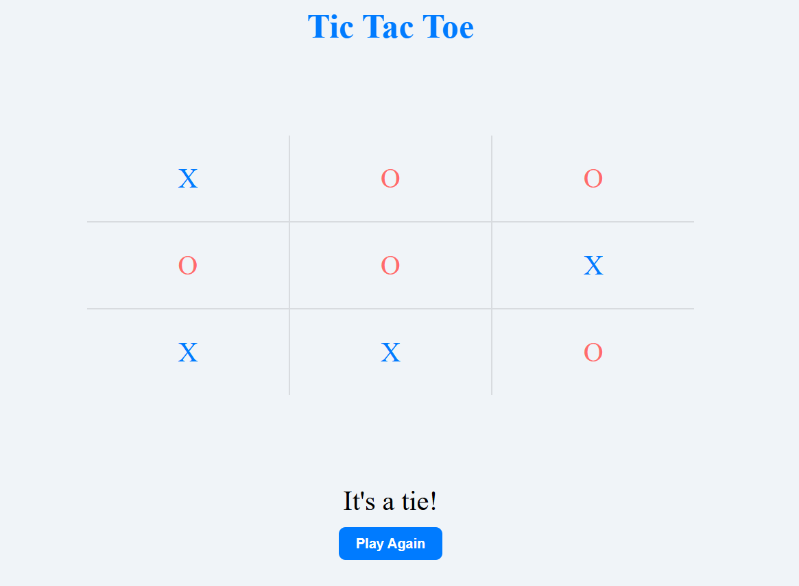

# ❌⭕ Tic Tac Toe – Vanilla JS

A simple yet polished Tic Tac Toe game built using **HTML**, **CSS**, and **Vanilla JavaScript (DOM APIs)**. Challenge a friend, track turns, and enjoy a clean UI without any frameworks!

---

## 🚀 Features

- 🎮 Two-player mode (X vs O)
- 🔁 Restart game functionality
- ✅ Win/draw detection
- 🎯 Visual feedback for moves and winning combinations
- 💡 Fully responsive and styled with plain CSS

---

## 🛠️ Tech Stack

- **HTML5**
- **CSS3**
- **JavaScript (ES6+)**
- **DOM Manipulation (No libraries or frameworks)**

---

## 📸 Preview

  

---

## 📂 Project Structure

